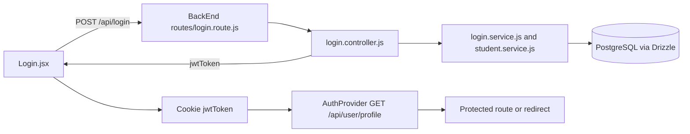

# RMS Frontend Architecture

## Purpose and scope

This document describes the frontend as it exists in `FrontEnd/`. It is a Vite single-page React application for routines, course data, resources, profiles, administrative tools, and AI-assisted features. It is a practical reference for extending this repository; it is not a claim that every page follows one perfectly uniform pattern.

The API counterpart is documented in [`../BackEnd/ARCHITECTURE.md`](../BackEnd/ARCHITECTURE.md). Source paths below are relative to `FrontEnd/` unless stated otherwise.

## Table of contents

1. [Technology stack](#technology-stack)
2. [Directory structure](#directory-structure)
3. [Application composition](#application-composition)
4. [Routing and access control](#routing-and-access-control)
5. [Rendering, state, and data flow](#rendering-state-and-data-flow)
6. [API integration](#api-integration)
7. [Authentication and authorization](#authentication-and-authorization)
8. [Components, styling, and UX conventions](#components-styling-and-ux-conventions)
9. [Implementation workflows](#implementation-workflows)
10. [Cross-layer examples](#cross-layer-examples)
11. [Observed limitations and recommendations](#observed-limitations-and-recommendations)

## Technology stack

| Technology | Where | Role in this implementation |
| --- | --- | --- |
| React 18 | `src/` | Function components, hooks, context, lazy page imports, local state. |
| React DOM | `src/main.jsx` | Mounts the application into `#root`. |
| React Router DOM 7 | `src/App.jsx`, components/pages | `BrowserRouter`, `Routes`, `Route`, `Navigate`, links, navigation, and query parameters. |
| Axios | `src/api.js` | One configured HTTP client used by pages and service modules. |
| js-cookie | `src/api.js`, auth pages | Reads/writes the `jwtToken` browser cookie. |
| Tailwind CSS 3 + PostCSS | `tailwind.config.js`, `src/index.css` | Utility styling, dark-mode variants, and a shared component-class layer. |
| React Icons | pages/components | Accessible decorative/action icons. |
| Vite | `vite.config.js` | Development server and production build. |

There is no Redux, React Query, form library, schema-validation library, or TypeScript configuration in the application source. State is deliberately lightweight: context for app-wide state and `useState`/`useEffect` in pages and reusable components.

## Directory structure

```text
FrontEnd/
├── index.html                 # Vite HTML shell; exposes #root
├── package.json               # Scripts and frontend dependencies
├── vite.config.js             # React Vite plugin only
├── tailwind.config.js         # Source scan and class-based dark mode
├── postcss.config.js          # Tailwind and Autoprefixer pipeline
├── vercel.json                # /api proxy and SPA-history fallback
├── public/
│   └── rms-icon.svg           # Public static asset
└── src/
    ├── main.jsx               # React entry point
    ├── App.jsx                # Providers, route table, route guard, app chrome
    ├── api.js                 # Axios instance and JWT interceptors
    ├── index.css              # Global tokens and reusable Tailwind component classes
    ├── assets/                # Bundled images used by pages
    ├── services/              # Focused API/domain helpers and cache utilities
    └── pages/
        ├── authentication/    # Login, registration, legacy logout screen
        ├── personal/          # Authenticated dashboard, routines, profile, courses
        ├── admin/             # Administrative workspace
        ├── CR/                # Class representative workflows
        ├── info/              # Public/shared information pages
        ├── room/, teacher/    # Routine lookup feature areas
        ├── components/        # Reusable page-level visual/domain components
        └── *.jsx              # Top-level feature pages
```

### Important files and ownership

| Location | Responsibility | Change it when… | Used by |
| --- | --- | --- | --- |
| `src/main.jsx` | Imports global CSS and renders `<App />`. | Bootstrapping fundamentally changes. | Browser only. |
| `src/App.jsx` | Owns provider nesting, route declarations, lazy imports, global loading/not-found UI, footer, and notification viewport. | Adding a route or app-wide context. | Every rendered page. |
| `src/api.js` | Defines base URL, JSON default, `jwtToken` request header, and unauthorized handling. | Transport/auth-header behavior changes. | All API callers. |
| `src/services/` | Small reusable API wrappers and pure domain helpers. `periodService.js` also provides a hook. | A behavior is reused or needs a stable client-side normalization boundary. | Pages and components. |
| `src/pages/` | Route-level feature composition and feature-local request/state logic. | Adding/changing a screen. | `App.jsx`. |
| `src/pages/components/` | Shared UI primitives (`ui.jsx`), header/footer, notifications, routine/resource UI, sponsor and Markdown helpers. | Visual/domain behavior is reused across pages. | Multiple pages. |
| `src/index.css` | Design tokens, dark theme variables, layout/card/form/button utility classes. | A visual primitive needs to be common. | All pages. |
| `vercel.json` | Sends production `/api/*` calls to the deployed API and sends browser navigations to the SPA entry. | Deployment API host or hosting behavior changes. | Vercel runtime. |

Do not put a new shared primitive in a route directory merely because that is the first caller. Put feature-specific composition in the page; promote it to `pages/components/` only after it has a meaningful reusable contract.

## Application composition

`main.jsx` is intentionally thin:

```jsx
createRoot(document.getElementById("root")).render(<App />)
```

`App.jsx` supplies context in this order:

```text
ThemeProvider
└─ BrowserRouter
   └─ SessionProvider
      └─ AuthProvider
         └─ FeatureSettingsProvider
            └─ AppFrame = AppRoutes + GlobalFooter + NotificationViewport
```

The four exported context hooks are the established app-level state interface:

| Hook | Data and behavior | Source of truth |
| --- | --- | --- |
| `useTheme()` | `theme`, `toggleTheme()` | React state plus `localStorage.theme` and the document `.dark` class. |
| `useActiveSession()` | active session, loading/error, `refreshActiveSession()` | `GET /api/session/active`. |
| `useAuth()` | login state, profile user, setter helpers, `refreshLoginStatus()` | `jwtToken` cookie verified by `GET /api/user/profile`. |
| `useFeatureSettings()` | AI feature availability, loading/error, refresh/setters | `GET /api/settings/ai`. |

Providers begin their own async load in `useEffect`. Consumers must therefore respect loading state or the nullable values they expose. This is why `AppRoutes` first waits for `loadingAuth` and why pages such as `AI.jsx` first wait for feature-setting state.

Route modules are code split with `React.lazy`; `Suspense` provides the same `AppLoading` fallback for all lazy pages. The root app does not use an error boundary.

## Routing and access control

The route table is centralized in `src/App.jsx`; there is no file-system router. To add a page, add its lazy import and a `Route` entry there.

### Route groups

| Group | Representative paths | Protection actually applied in `AppRoutes` |
| --- | --- | --- |
| Public | `/`, `/routine/section`, `/routine/teacher`, `/classroom/routine`, `/resources`, `/info/teacher`, `/info/section`, `/info/community`, `/info/contributor`, `/info/bus` | No route-level login check. |
| Auth entry | `/auth/login`, `/auth/reg` | Logged-in users are redirected to `/homepersonal`. |
| Authenticated personal | `/homepersonal`, `/home`, `/edit/details`, `/courseadddrop`, `/showall`, `/routine/personalroutine` | Redirects to `/auth/login` without an authenticated session. |
| Authenticated privileged UI | `/CR`, `/CR/routine`, `/admin/users`, `/ai`, `/externalagent`, `/externalagent/teacherinfoextract`, `/info/course`, `/info/materials` | Only a login check in the route table. Some pages additionally check roles/features; the server is the authoritative authorization boundary. |
| Fallback | `*` | `NotFound` page. |

Navigation uses `Link`, `NavLink`, and `useNavigate` from React Router. `Header.jsx` derives `isAdmin` and `isCrOrAdmin` from `useAuth().user.type` and conditionally shows links. It also hides the AI link unless the globally fetched feature setting is enabled. This is navigation/UI gating, not security.

`AdminRoles.jsx` independently redirects a non-admin user after it has loaded their profile. CR pages rely on the server's CR middleware for enforcement. A new protected route should use the existing `isLoggedIn ? <Page /> : <Navigate …>` form and should still be protected by the corresponding backend endpoint middleware.

## Rendering, state, and data flow

### Typical request path

```mermaid
sequenceDiagram
  participant U as User
  participant P as Page or shared component
  participant S as Service helper (when used)
  participant A as src/api.js
  participant B as Backend /api route
  participant R as React state

  U->>P: input, navigation, or effect
  P->>S: call normalized helper (optional)
  S->>A: api.get/post/etc.
  A->>A: read jwtToken; add jwtToken header
  A->>B: HTTP request
  B-->>A: JSON response or error
  A-->>S: Axios response/rejection
  S-->>P: normalized data (optional)
  P->>R: set loading/data/error state
  R-->>P: React re-render
```

The project has two real patterns:

1. **Service-backed flow.** `sessionService.js`, `settingsService.js`, `sponsorService.js`, `announcementService.js`, `facultySearchService.js`, and `adminService.js` isolate endpoint details and normalize response shapes. Use this when the operation will be shared or has domain-specific normalization.
2. **Page-owned flow.** Many feature pages import `api` directly, manage a local loading/error/result state triplet, and call endpoints in effects or submit handlers. `ResourceBrowser.jsx`, `CourseAddDrop.jsx`, and `AdminRoles.jsx` are representative. Preserve this style inside an isolated one-page workflow rather than creating a thin one-function service solely for symmetry.

`cacheService.js` supplies an opt-in, TTL-based `sessionStorage` cache (`cachedRequest`, 60 seconds by default) and prefix invalidation. It is used for selected routine/profile fetches, not as a global cache. `routineDetails.js`, `profileResourceStatsUtils.js`, and much of `periodService.js` are pure shaping/formatting utilities. `periodService.js` also supplies `usePeriods()` and uses a hard-coded fallback schedule if loading fails.

### Loading and errors

Each screen generally owns its request lifecycle. Common conventions are:

- Set a loading/submitting boolean immediately before the async request and clear it in `finally`.
- Render `LoadingState`, `EmptyState`, `Notice`, a screen-local error string, or disabled buttons while work is pending.
- Read backend errors defensively from `error.response?.data?.message`, `.msg`, or a fallback string.
- Use `notify()` from `pages/components/notifications.js` for transient global feedback; `NotificationViewport` is installed once in `AppFrame`.

There is no universal response envelope or global error handler in the frontend. A caller must normalize the endpoint response it consumes (`rows`, `row`, arrays, and direct objects all occur).

## API integration

### Client configuration and deployment URL

`src/api.js` is the sole shared Axios instance:

```js
const api = axios.create({
  baseURL: import.meta.env.VITE_URL || "",
  headers: { "Content-Type": "application/json" },
});
```

- In development, set `VITE_URL` when the API is on a different origin. An empty value means same-origin `/api/...` requests.
- In the tracked Vercel configuration, `/api/:path*` rewrites to `https://iiuc-resources-management-api.vercel.app/api/:path*`; the frontend still uses relative endpoint strings.
- A request interceptor reads `Cookies.get("jwtToken")` and sends it in the custom `jwtToken` header. It does not use an `Authorization: Bearer` header.
- A response interceptor removes the token on 401 or 403, then rejects the original error. It does not navigate or refresh the React auth context itself.

### Request formats

JSON is the default. Query parameters are passed through Axios `params`, and path values are typically protected with `encodeURIComponent`. Examples include `searchFaculty()` and `updateSession()` in `services/`.

The established multipart form pattern is to create a `FormData`, append fields and the optional file, then override content type:

```js
const formData = new FormData();
formData.append("title", title);
if (imageFile) formData.append("image", imageFile);

await api.put("/api/admin/announcement", formData, {
  headers: { "Content-Type": "multipart/form-data" },
});
```

See `services/announcementService.js`, `services/sponsorService.js`, and profile/external-agent page handlers for live uses. The backend field names are part of the API contract: announcement `image`, sponsor `logo`, profile `profilePic`, and external-agent `pdf`.

### Preferred new integration

For a reusable operation, create `src/services/<feature>Service.js`, import the configured `api`, keep endpoint paths there, and return the normalized shape the UI needs. Then let a page own its loading/error state:

```js
// src/services/exampleService.js
import api from "../api";

export async function fetchExample(id) {
  const response = await api.get(`/api/examples/${encodeURIComponent(id)}`);
  return response.data?.row ?? null;
}
```

Do not bypass `api.js`, otherwise the base URL and JWT header behavior diverge. For an operation used only by one large feature page, a direct `api` call is consistent with existing code, but normalize its response before distributing it to child components.

## Authentication and authorization

### Authentication sequence

1. `Login.jsx` posts `{ id, password }` to `/api/login`; `RegistrationForm.jsx` posts registration data to `/api/register/new`.
2. The backend response includes `{ jwtToken }`.
3. The frontend stores it with `Cookies.set("jwtToken", jwtToken, { expires: 7 })`.
4. `refreshLoginStatus()` calls `GET /api/user/profile`; the Axios interceptor transmits the token in `jwtToken`.
5. `AuthProvider` stores the returned first profile item as `user` and sets `isLoggedIn` only if it received one.
6. `AppRoutes` permits protected pages and `Header` derives the role-specific navigation from `user.type`.
7. Logout removes the cookie and clears context. A 401/403 only removes the cookie; the next state refresh/navigation handles visible logout.

This is token persistence in a JavaScript-readable cookie, not an HTTP-only server session. Token expiry is configured by the backend; the frontend's seven-day cookie lifetime does not override it.

Authentication answers “is this request from a valid signed-in identity?” Authorization answers “may that identity perform this action?” The client uses role checks to improve navigation and feedback, but backend middleware/controllers make the actual student/CR/admin decision. Never rely on a hidden client link or a client redirect to secure new data.

## Components, styling, and UX conventions

### Component organization

- Use a route-level component as the default export of a page file and compose it from `Header`, `PageShell`, shared components, and feature-local functions.
- Prefer named exports for utilities and reusable subcomponents (`ui.jsx`, `SponsorDisplay.jsx`); use default exports for the primary page/component.
- Component props are plain JavaScript; the codebase has no PropTypes or TypeScript contracts. Follow existing defensive optional chaining and defaults at boundaries.
- `pages/components/ui.jsx` is the visual primitive catalog: `PageShell`, `SectionHeading`, `FormField`, `SuggestionList`, `MetricCard`, `LoadingState`, `EmptyState`, `Notice`, and `NotificationViewport`, plus `cx()` for conditional class joining.
- `RoutineTable`, `RoutineDetailsModal`, `ResourceBrowser`, `ResourceHighlights`, and `ProfileResourceStats` are reusable domain components rather than generic primitives.

### Forms and validation

Forms are controlled inputs with `useState`, `onSubmit`, immediate client checks, a submit boolean, API call, and displayed errors. `Login.jsx` and `RegistrationForm.jsx` show the standard structure. The client checks usability (empty fields, confirmation fields, simple lengths); backend validation remains required and is not duplicated universally.

### Styling, responsive behavior, and accessibility

`index.css` defines design tokens (`--page-bg`, `--brand`, panel colors), light/dark variants, and reusable classes such as `.app-root`, `.page-wrap`, `.surface-card`, `.form-field`, and button classes. Tailwind utilities then do most component-level layout and breakpoint work (`sm:`, `lg:`, etc.). `tailwind.config.js` uses `darkMode: "class"`, which `ThemeProvider` toggles on `<html>`.

Existing UI supports small viewports with a 320px body minimum, responsive grids, and a mobile Header. It uses labels through `FormField`, `aria-label` for icon-only controls, focus-visible rings, disabled controls during work, semantic button/form elements, and non-color status text/icons in many components. These are established practices, not proof of a complete accessibility audit.

## Implementation workflows

### Add a page and route

1. Create `src/pages/Example.jsx`; include `Header` and shared UI primitives where the page is a full screen.
2. Use local `useState`/`useEffect` or a focused service helper for data.
3. Add `const Example = lazy(() => import("./pages/Example"));` to `App.jsx`.
4. Add a `<Route path="/example" element={<Example />} />` in `AppRoutes`. Apply the existing login `Navigate` wrapper if it is authenticated.
5. Add a Header navigation item only when the route should be discoverable. Do not mistake hiding it for authorization.

### Add a reusable component

1. Keep it in the feature directory if it has one caller; place it in `src/pages/components/` when it has a reusable API.
2. Accept data and callback props rather than importing page state.
3. Reuse `PageShell`, `Notice`, `LoadingState`, and CSS component classes instead of recreating their visual semantics.
4. Export a descriptive component name and add graceful empty/loading behavior when it fetches or presents remote data.

### Add an API integration

1. Ensure the backend endpoint exists and its response shape is known.
2. Put shared endpoint/normalization code in `services/`; otherwise import `api` into the owning page.
3. Encode user-supplied path segments and use `params` for query parameters.
4. Maintain `loading`, error, and result state. Display the error in `Notice` or the feature's current feedback convention.
5. Clear relevant `cacheService` prefixes after a mutation if that feature currently caches the affected read.

### Add a form

1. Model the form state with `useState`; use `FormField` for labels/helper text where appropriate.
2. Validate the same class of input as nearby forms, disable duplicate submits, and clear stale messages before submission.
3. Submit through `api`, show a human-readable failure, and update/refetch the displayed state after success.
4. Use `FormData` only for an endpoint that actually accepts multipart content.

### Add shared state

Use local state first. Create a provider in `App.jsx` only for state required across unrelated routes/app chrome, such as authenticated user, active session, theme, or global feature availability. Export a `useX` hook beside the context and include a refresh function when the server is its source of truth.

## Cross-layer examples

### Login and route entry



The profile call is important: storing a token alone does not set the app user. `AuthProvider` validates it through the profile endpoint and exposes profile/role data to the UI.

### Resource rating

`ResourceBrowser.jsx` loads public resources and a selected resource's ratings, then a signed-in user posts a rating to `/api/resources/:id/star`. The Axios interceptor supplies the token. The backend's resource route applies student authorization, its controller validates/transforms request data, and `resources.service.js` performs an upsert inside a transaction and recalculates the resource average. The component refreshes/updates its local presentation state. This is the clearest existing example of a resource mutation that uses a server transaction rather than trusting a client-side aggregate.

## Observed limitations and recommendations

These are observations from the current source, not existing guarantees:

- The root `AppRoutes` protects login state but does not impose route-level role guards for `/admin/users` or CR pages. `AdminRoles.jsx` adds a client check and the backend enforces authorization. **Recommendation:** extract a role-aware route guard if more privileged routes are added.
- API calls are split between service modules and direct page calls, and response shapes vary (`row`, `rows`, raw arrays). **Recommendation:** use feature service modules for new cross-page operations and document stable response contracts.
- `api.js` removes an invalid token but does not directly synchronize `AuthContext` or redirect. **Recommendation:** if UX requires immediate global logout, add a deliberate auth-expiry bridge rather than duplicating redirects in each page.
- There is no app-wide error boundary, request cancellation policy, or query cache. **Recommendation:** add these only if the product needs them; do not present them as current architecture.
- The tracked Vercel rewrite hard-codes a deployed API host. **Recommendation:** consider environment-specific hosting configuration if preview/staging deployments become important.
